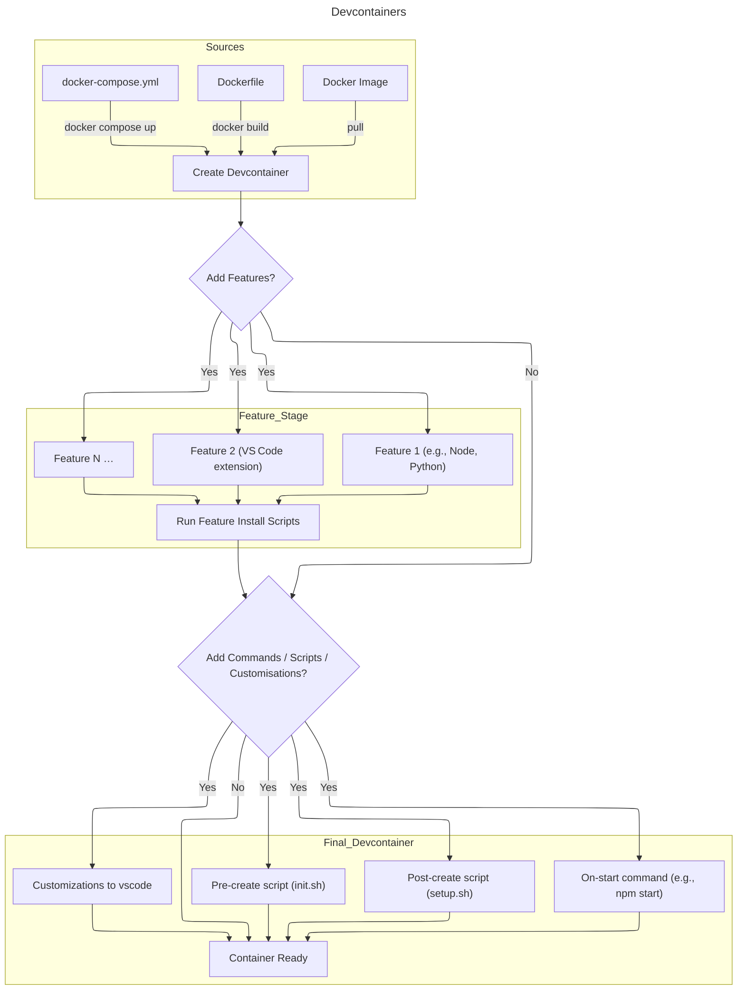

---
date:
  created: 2025-10-28
categories:
  - devcontainers
  - application development
  - containers
tags:
  - personal
authors:
  - brian
---

# Introduction to Devcontainers

!!!Todo
    what is Devcontainers?
    why should it be used?

## How to use Devcontainers?

Devcontainers is a technology that allows a custom environment to be created based on container technology.  

<!-- more -->

The diagram below shows the options for creating the required environment for a development project:

### Source

!!!Todo
    What the source of the Devcontainer is - 3 options
    Docker-compose only 1 containers is mounted in the editor, others provide services

### Features
!!!Todo
    what are features
    Issues with different OS distributions

### Scripts and customisations

!!!Todo
    How can I customise a devcontainer before it is used?
    Scripts run at different stages, explain
    How to add plugins into the VS Code environment

## Using Devcontainers

!!!Todo
    How to use a devcontainer in a project

## Speeding up containers

!!!Todo
    The devcontainers CLI
    Speed up by creating a custom container image and save to repo

