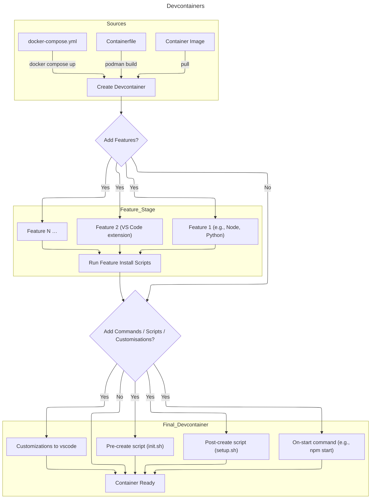

---
date:
  created: 2025-11-04
categories:
  - devcontainers
  - application development
  - containers
tags:
  - personal
authors:
  - brian
---

# Introduction to Devcontainers

Devcontainers (short for development containers) are a way of describing, building, and running a complete development environment inside a container.

The definition lives in a small JSON/YAML file (devcontainer.json) together with optional Container assets that live under a .devcontainer/ folder at the root of your project.

## TL;DR

- Devcontainers = declarative Container‑based dev environments that work locally (VS Code Remote – Containers) and in the cloud (Codespaces, Gitpod).
- Choose a source: pre‑built image, custom Containerfile, or docker‑compose stack.
- Enrich your environment with features, which are reusable install scripts; be mindful of OS‑specific quirks.
- Hook into the lifecycle via preCreateCommand, postCreateCommand, and onStartCommand. Install VS Code extensions declaratively or via script.
- Adopt them in a project by adding a .devcontainer/ folder, opening the repo in VS Code, and letting the tooling do the rest.
- Speed matters: use the Dev Container CLI for CI, and consider pre‑building and publishing a custom image to avoid repeated builds.

<!-- more -->


## Why use them?

- Consistency: Every teammate (or CI job - automated build job for a Continuous Integration pipeline) gets exactly the same tools, libraries, and OS‑level dependencies. No more “it works on my machine”.
- Isolation: Your host stays clean—no global npm/pip/ruby installations that could clash with other projects.
- Portability: The same definition can be used locally (VS Code Remote – Containers), in the cloud (GitHub Codespaces, Gitpod) or on any CI platform that supports Containers.
- Speed of onboarding: New contributors just open the repo and click “Reopen in Container”. All tooling is ready within seconds.
In short, devcontainers let you treat the entire development stack as code.

## How to use Devcontainers?

Devcontainers is a technology that allows a custom environment to be created based on container technology.

When VS Code (or another IDE or client) sees a .devcontainer/ folder it reads devcontainer.json, builds or pulls the referenced Container image(s), runs any defined scripts, and finally mounts your source code into the resulting container. The workflow looks like this:



## Source

A devcontainer can be created from three primary sources. Each source determines how the base image (the “starting point” of your container) is obtained:

|Source	| How it works	|Typical use‑case
|-------|---------------|----------------
Container Image ("image": "node:20" in devcontainer.json)	| VS Code pulls a pre‑built image from a registry (Docker Hub, Quay.io, GHCR, etc.) and uses it as the base. No build step is required. |	Quick prototypes where you only need a known runtime (e.g., python:3.13).|
| Containerfile ("dockerFile": "Containerfile" ) | The CLI builds an image locally using the Containerfile you provide, then runs that image. This gives full control over OS packages and custom layers. |	When you need extra system libraries, custom user creation, or a non‑standard base (e.g., Alpine + OpenJDK). |
| docker‑compose.yml ("dockerComposeFile": "docker-compose.yml" ) |	A compose file can define multiple services (database, cache, etc.). One of the services is marked as the “workspace” container and gets the devcontainer features. The other containers are started in parallel and remain reachable via their service names.	| Full‑stack apps where you want a DB, Redis, or a message broker running alongside your IDE. Only the workspace container is mounted into VS Code; all others act as supporting services. |


!!!Note 
    In a compose scenario only one service can be designated as the development container (the one that receives the devcontainer.json configuration). The rest are treated as background services.

## Features

Features are reusable, community‑maintained scripts that extend a devcontainer without you having to write low‑level install steps. They live in the [Dev Container Feature Registry](https://containers.dev/features), can be pulled directly from the web or loaded locally and can be referenced directly in devcontainer.json:

```JSON
{
  "features": {
    "ghcr.io/devcontainers/features/node:1": { "version": "20" },
    "ghcr.io/devcontainers/features/python:2": { "version": "3.12", "installTools": true }
  }
}
```

Features can provide support for programming languages such as JavaScript, Java or Python, a capability such as running containers within a container or tool such as Skopeo which allows images to be copied between registries.

When the container is built, each feature runs its own install script (usually a Bash snippet) that adds the requested toolset and optionally sets up environment variables.

### Issues with different OS distributions

Features are written against a base distribution—most of them target Debian/Ubuntu because those images dominate the devcontainer ecosystem. This can cause friction when you:

- Choose Alpine: Alpine uses apk instead of apt. A feature that runs apt-get install will fail unless it detects the distro and switches to apk. Some features include such detection, but many do not.
- Pick Red Hat‑based images (Fedora, RHEL, UBI): The package manager changes to dnf/yum. Again, you need either a feature that explicitly supports those or you must write your own.
- Use non‑Linux OS: Features assume Linux; they cannot run on Windows containers.

If you need a non‑Debian base, the safest path is to fork an existing feature and adapt its install script, or write a custom feature from scratch (the registry supports that out of the box).

## Scripts and Customisations

Beyond features, devcontainers let you hook into the lifecycle at several points. This is where you can run arbitrary commands, copy files, or tweak VS Code itself.

| Lifecycle hook	| Where to define it |	When it runs |
|-----------------|--------------------|---------------|
| initializeCommand |	In devcontainer.json ("initializeCommand": "./.devcontainer/init.sh" ) |	Executed before the Docker image is built. Useful for generating files that affect the build (e.g., writing a .npmrc). |
| Feature install	| Declared under "features"; run automatically during image build after the base Containerfile steps.	| During container build – before the container starts. |
| onCreateCommand | In devcontainer.json ("onCreateCommand": "./devcontainer/setup.sh" ) | This command is run inside a container immediately after it has started for the first time. |
| updateContentCommand | In devcontainer.json ("updateContentCommand": "./devcontainer/update.sh" ) | This command runs after **onCreateCommand** It executes inside the container whenever new content is available in the source tree during the creation process, but will execute at least once. |
| postCreateCommand (setup.sh) |	In devcontainer.json ("postCreateCommand": "./.devcontainer/setup.sh" )	| Runs inside the running container after it has started and been assigned to a user for the first time, but before VS Code attaches. Ideal for installing npm packages, creating virtual environments, or seeding a database. |
| postStartCommand	 | In devcontainer.json ("postStartCommand": "npm start")	| Executed each time the container is re‑started (e.g., after you stop and reopen). Good for launching long‑running processes like a local server or watch task. |
| postAttachCommand | In devcontainer.json ("postAttachCommand": "./.devcontainer/attach.sh" ) | Runs each time a tool has successfully attached to the container |  
| VS Code extensions	| "extensions": ["ms-python.python", "dbaeumer.vscode-eslint"] in devcontainer.json	| VS Code installs the listed extensions automatically when it connects to the container. |

Example: Adding a custom script

```bash
# .devcontainer/setup.sh
#!/usr/bin/env bash
set -e

echo "Installing project‑level npm dependencies..."
npm ci

echo "Creating Python virtual environment..."
python -m venv .venv
source .venv/bin/activate
pip install -r requirements.txt

# Optional: run a one‑time DB migration
if [ -f manage.py ]; then
  python manage.py migrate --noinput
fi
```

And the matching devcontainer.json snippet:

```JSON
{
  "name": "My Awesome App",
  "dockerFile": "Containerfile",
  "features": {
    "ghcr.io/devcontainers/features/node:1": { "version": "20" },
    "ghcr.io/devcontainers/features/python:2": { "installTools": true }
  },
  "postCreateCommand": "./.devcontainer/setup.sh",
  "extensions": [
    "ms-python.python",
    "dbaeumer.vscode-eslint"
  ],
  "forwardPorts": [3000, 5432],
  "remoteUser": "vscode"
}
```

## Adding VS Code extensions via scripts (alternative)
You can install VS Code Extensions from the marketplace or a Git Repo .  However, if you need to install an extension that isn’t available on the marketplace or want a specific version, you can do it in postCreateCommand:

```bash
code --install-extension ms-toolsai.jupyter@2024.9.0 --force
```

The CLI code is pre‑installed inside the container runtime.

## Using Devcontainers

Putting everything together, here’s a step‑by‑step guide to adopt devcontainers in an existing project:

1. Create the .devcontainer/ folder at the root of your repo.

2. Add a Containerfile (or pick an image) that contains the OS you want. A minimal example for Node + Python:

    ```Containerfile
    # .devcontainer/Containerfile
    FROM mcr.microsoft.com/vscode/devcontainers/base:ubuntu-22.0

    # Install any global system packages you need
    RUN apt-get update && export DEBIAN_FRONTEND=noninteractive \
        && apt-get install -y --no-install-recommends git curl
    ```

3. Write devcontainer.json referencing the Containerfile and desired features/extensions (see previous section for a full example).

4. Open the folder in VS Code. You’ll see a prompt:

    !!!Info "VSCode prompt"
        “Folder contains a Dev Container configuration – Reopen in Container?”

    Click it, or run the command Remote-Containers: Open Folder in Container.

5. VS Code will now:

    - Build the image (caching layers where possible).
    - Run any preCreateCommand / feature install scripts.
    - Start the container and execute postCreateCommand.
    - Attach the editor, installing listed extensions automatically.

6. Start coding! Your terminal (`Ctrl+``) is already inside the container, your project files are mounted at /workspace/<projectfolder> within the container, your ports are forwarded, and you can run debuggers as if they were local.

## Using Devcontainers on GitHub Codespaces

The same devcontainer.json works unchanged in GitHub Codespaces:

1. Push your repo to GitHub.
2. Click Code → Codespaces → New codespace (or add a .devcontainer/devcontainer.json reference in the repository’s Codespaces settings).
3. The platform builds the container on the backend and presents you with an online VS Code instance.
No extra configuration is required—this is one of the biggest advantages of keeping everything declarative.

## Speeding up Containers

While devcontainers are great for reproducibility, building them from scratch each time can feel slow, especially in CI pipelines or when onboarding many developers. Two strategies help you keep the experience snappy:

### The devcontainer CLI - Command Line Interface

Microsoft ships a [Dev Container CLI (devcontainer)](https://github.com/devcontainers/cli) that mirrors the VS Code UI workflow but runs entirely in your terminal. Typical commands:

```bash
# Build the container without launching VS Code (useful for CI)
devcontainer build --workspace-folder . --output-path ./image.tar

# Start a devcontainer and attach a shell
devcontainer up --workspace-folder .
devcontainer exec --workspace-folder . -- bash
```

The CLI respects all devcontainer.json options, runs feature install scripts, and caches layers in Docker’s normal cache. Using it in CI lets you run tests inside the same environment developers use locally.

### Pre‑build a custom image and push to a registry

If your devcontainer has heavy system dependencies (e.g., large language runtimes, compiled libraries), consider pre‑building an image once and reusing it:

1. Create a dedicated Containerfile that includes all features you always need.

    ```
    # .devcontainer/Containerfile.prebuilt
    FROM mcr.microsoft.com/vscode/devcontainers/base:ubuntu-22.04

    # Install Node, Python, and common tools in one layer
    RUN apt-get update && export DEBIAN_FRONTEND=noninteractive \
        && apt-get install -y curl git build-essential \
        && curl -fsSL https://deb.nodesource.com/setup_20.x | bash - \
        && apt-get install -y nodejs python3-pip

    # Optional: install VS Code extensions globally (they’ll be available for any container based on this image)
    RUN code --install-extension ms-python.python \
        && code --install-extension dbaeumer.vscode-eslint
    ```

2. Build and push the image:

    ```bash
    podman build -t quay.io/your-org/my-devcontainer:latest -f .devcontainer/Containerfile.prebuilt .
    podman push quay.io/your-org/my-devcontainer:latest
    ```

    !!!Note
        If your devcontainer definition contains features, you can use the devcontainer CLI to build the image from the devcontainer.json definition.  Using `devcontainer build` rather than `podman build` will include all the features within the build image.  This can further reduce the work needed to be done when the devcontainer starts.

        Running `devcontainer build --help` shows all the possible command line options available,

3. Reference the pre‑built image in devcontainer.json:

    ```JSON
    {
      "name": "Pre‑built Dev Container",
      "image": "quay.io/your-org/my-devcontainer:latest",
      "features": {},
      "extensions": [],
      "postCreateCommand": "./.devcontainer/setup.sh"
    }
    ```

    Now, when a developer opens the repo, VS Code only needs to pull the image (seconds) instead of rebuilding it layer‑by‑layer. The same image can be used in CI:

    ```YAML
    # .github/workflows/ci.yml
    jobs:
      test:
        runs-on: ubuntu-latest
        container:
          image: quay.io/your-org/my-devcontainer:latest
        steps:
          - uses: actions/checkout@v4
          - name: Run tests
            run: npm test   # or pytest, etc.
    ```

## Bonus tip: Multi‑stage Containerfiles for faster builds
If you need to compile something (e.g., native Node addons), split the build into two stages:

```Containerfile
# Build stage – heavy tools, compilers
FROM mcr.microsoft.com/vscode/devcontainers/base:ubuntu-22.04 AS builder
RUN apt-get update && export DEBIAN_FRONTEND=noninteractive \
    && apt-get install -y build-essential cmake

# Compile your native module here...
COPY src/ /src/
RUN cd /src && make

# Runtime stage – slim, only runtime deps
FROM mcr.microsoft.com/vscode/devcontainers/base:ubuntu-22.04
COPY --from=builder /src/build/output.so /usr/local/lib/
```

Only the lightweight runtime image ends up in the registry, dramatically reducing pull size.

Give it a try on your next project—your future self (and every teammate) will!
